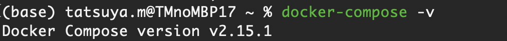

# How to create react project in Docker

## Check docker and docker compose settings. If version information is displayed in the return value, it is OK

```terminal
docker -v
```

in my case


```terminal
docker-compose -v
```

in my case


## Docker download link in case the version does not show up in the terminal

[Docker App Download Link](https://docs.docker.jp/get-docker.html)

## How to settings

### Launch docker application *no command

### make a directory for app

```terminal
mkdir front
```

### Temporarily launch a container, create a react project in the container, and then destroy the container

```terminal
docker compose run --rm front sh -c "npx create-react-app app"
```

### When the following error statement is displayed in the terminal

#### step1 - Open docker app settings


#### step2 - Click on the file share in Resources and add the project directory


#### Note that if you have a weak Internet connection, the project may stop with an error before it is completed. In this case, please refrain from downloading large files at the same time

#### If you want to create a project in typescript, use the following command

```terminal
docker compose run --rm front sh -c "npx create-react-app app --template typescript"
```

### If able to do so, wait a few minutes \.\.\.

### Start containers in the background of the terminal

```terminal
docker-compose up -d
```

### Entering the Container

```terminal
docker compose exec front sh
```

### Command to go to the application directory and start npm

```terminal:terminal(in app)
cd app && npm start
```

#### If you want to use tailwindcss, run the following command after entering the container

```terminal
npm install -D tailwindcss postcss autoprefixer && npx tailwindcss init -p
```

### Command to stop a running container

```terminal
docker compose down
```
