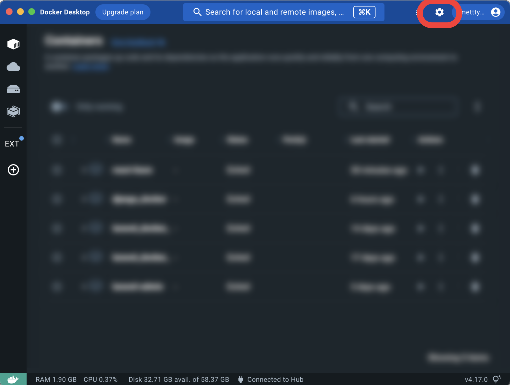

# docker code

## Check docker and docker compose settings. If version information is displayed in the return value, it is OK

```docker -v```

```docker-compose -v```

## Download link

[Docker Download Link](https://docs.docker.jp/get-docker.html)

## How to settings

### Launch docker application *no command

### make a directory

```mkdir front```

### Temporarily launch a container, create a react project in the container, and then destroy the container

```docker compose run --rm front sh -c "npx create-react-app app"```

### When the following error statement is displayed in the terminal

#### step1 - Open docker app settings



#### step2 - Click on the file share in Resources and add the project directory


### Start containers in the background of the terminal

```docker-compose up -d```

### Entering the Container

```docker compose exec front sh```

### Command to go to the application directory and start npm

```cd app && npm start```

### Command to stop a running container

```docker compose down```

